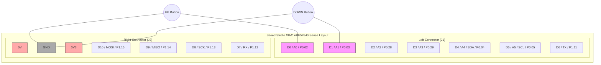

# Wiring Diagram

This page describes the hardware connection for the Finger Score ring.

## Components
- **Microcontroller**: Seeed Studio XIAO nRF52840 Sense
- **Switches**: 2x Tactile Push Buttons (Up / Down)

## Reference Pinout Image

## Wiring Scheme

The firmware uses internal pull-up resistors (`INPUT_PULLUP`), so the buttons should connect the digital pins directly to **GND** when pressed.

## Pin Mapping Table

| Function | XIAO Pin | Type | Notes |
| :--- | :--- | :--- | :--- |
| Score Up | **D0** | Digital Input | Connect to GND via button |
| Score Down | **D1** | Digital Input | Connect to GND via button |
| Ground | **GND** | Power | Common ground for both buttons |

## Visual Guide
1. Solder one leg of the **Up Button** to pin **D0**.
2. Solder one leg of the **Down Button** to pin **D1**.
3. Solder the other legs of **both buttons** to a **GND** pin.
